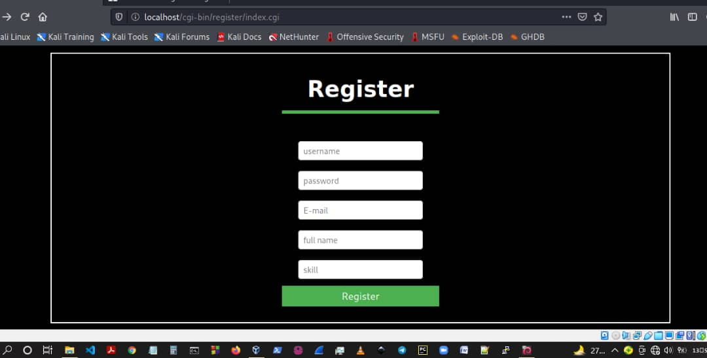
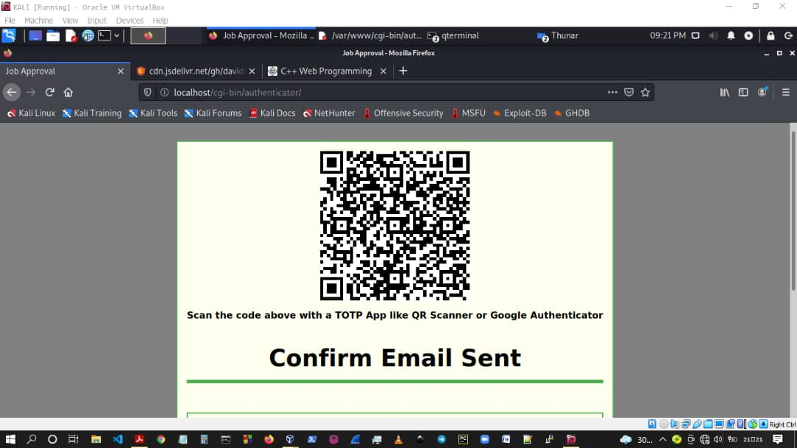
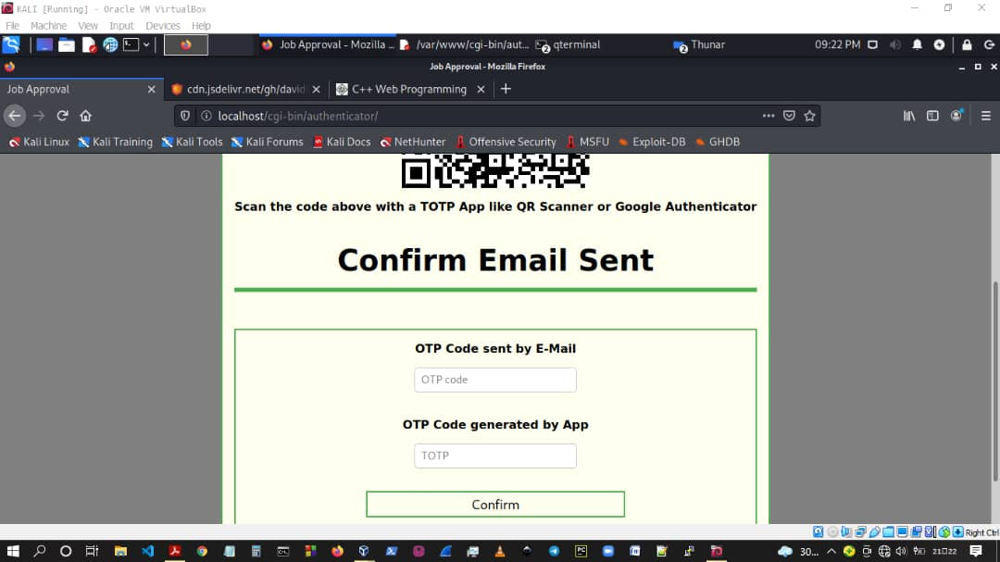
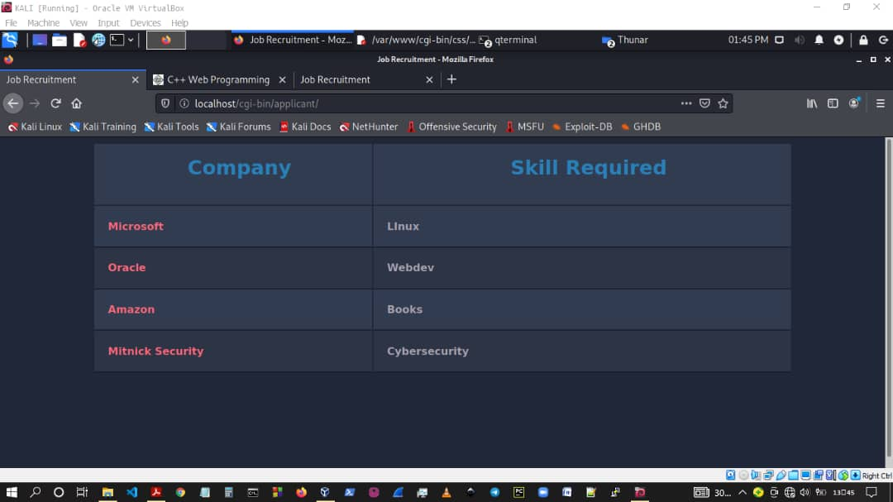

# Job_Recruitment_Portal
This repository houses the source codes of a CGI website written in C/C++.

# Description
This is a CGI website designed to mimic a job recruitment portal. It only work with three users - Admin, Company, and applicant.

An admin is required to create an account and also login to approve companies or applicants.

Each company or applicant is also saddled with the responsibility of creating an account by providing their username, password, email, and skills( an applicant provides his skills, while a company specifies the skills it requires from an applicant.)

When an account is created by an admin, company, or applicant, they are redirected to a login page, where an applicant can view companies requiring his/her skills and a company can view applicants having the skill it requires.

# Image
Home Page

Admin 3-FA Page

Admin 3-FA Page ( when scrolled up)

Applicant Page

